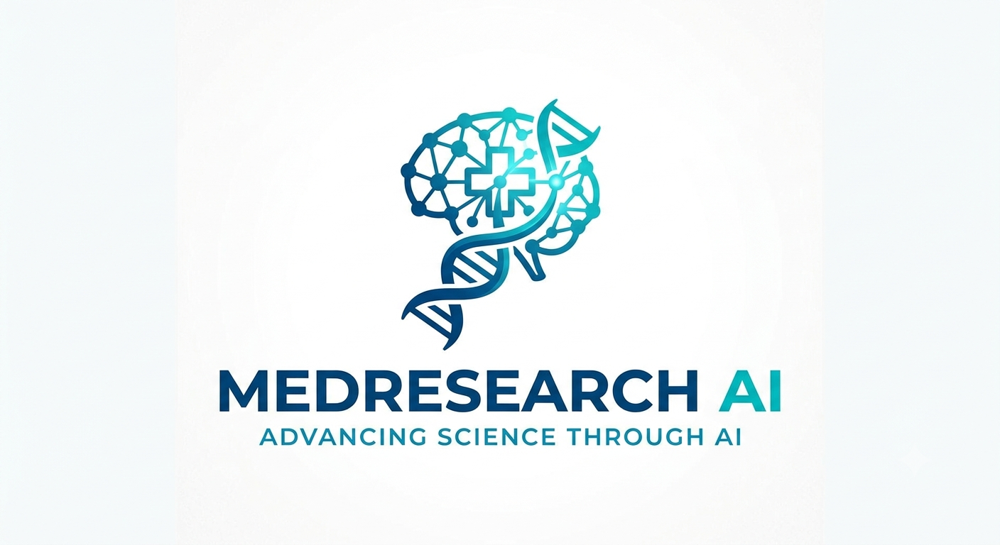

<div align="center">



# MedResearch AI


\### Governed Multi-Agent Medical Research System


\*\*6 AI agents · 71 languages · Voice output · Image OCR · PDF reports · Governance-enforced\*\*


\[!\[Live Demo](https://img.shields.io/badge/🚀\_Live\_Demo-medresearch--ai.streamlit.app-00d4ff?style=for-the-badge)](https://medresearch-ai.streamlit.app)

\[!\[Python](https://img.shields.io/badge/Python-3.12-3776AB?style=for-the-badge\&logo=python\&logoColor=white)](https://python.org)

\[!\[Streamlit](https://img.shields.io/badge/Streamlit-1.40-FF4B4B?style=for-the-badge\&logo=streamlit\&logoColor=white)](https://streamlit.io)

\[!\[License](https://img.shields.io/badge/License-MIT-green?style=for-the-badge)](LICENSE)


\[\*\*🌐 Try Live App\*\*](https://medresearch-ai.streamlit.app) · \[\*\*📖 Documentation\*\*](docs/) · \[\*\*🐛 Report Bug\*\*](https://github.com/Ayush-5787/medresearch-ai/issues)


</div>


\---


\## 📖 What is MedResearch AI?


MedResearch AI is a \*\*governed multi-agent system\*\* that answers medical questions with \*\*traceable, verified citations\*\* — and \*\*refuses\*\* when it can't verify claims.


Unlike generic chatbots, MedResearch AI:


\- 🔍 \*\*Searches\*\* PubMed + trusted web sources

\- 📖 \*\*Extracts\*\* every claim with source attribution

\- ✍️ \*\*Writes\*\* answers with inline citations

\- 🔎 \*\*Critiques\*\* its own output

\- ✅ \*\*Verifies\*\* every claim against its source

\- 🛡️ \*\*Enforces\*\* 6 governance rules before showing any answer

\- 🚫 \*\*Refuses\*\* personal medical advice, prescriptions, and diagnoses


\---


\## ✨ Features


| Feature | Description |

|---------|-------------|

| 🤖 \*\*6-Agent Pipeline\*\* | Search → Reader → Writer → Critic → Revision → Verifier |

| 🌐 \*\*71 Languages\*\* | Auto-detect + full translation (Hindi, Spanish, French, German, Arabic, Japanese, Tamil, and 64 more) |

| 🔊 \*\*Voice Output\*\* | Text-to-speech in 30 languages (Google TTS) |

| 📷 \*\*Image Input\*\* | OCR for prescriptions, medicine boxes, medical reports (Tesseract) |

| 📄 \*\*PDF Reports\*\* | Professional PDF with answer, sources, verification, governance report |

| 🛡️ \*\*Governance (6 Rules)\*\* | Confidence, citation coverage, verification rate, refusal logic, disclaimers, source quality |

| ✅ \*\*Per-Claim Verification\*\* | Every claim verified against its source (VERIFIED / PARTIALLY / NOT / CONTRADICTED) |

| 🕸️ \*\*Evidence Graph\*\* | Visual map of claims ↔ sources |

| 🌍 \*\*Country-Aware\*\* | Emergency numbers + trusted sources per country (10 countries) |

| 🚫 \*\*Refusal Mechanism\*\* | Refuses personal advice, prescriptions, off-topic questions |

| ⚠️ \*\*Medical Disclaimer\*\* | Every answer includes disclaimer |


\---


\## 🏗️ Architecture


```

┌─────────────────────────────────────────────────────────────┐

│                     USER QUESTION                           │

│              (71 languages supported)                       │

└────────────────────────┬────────────────────────────────────┘

&#x20;                        │

&#x20;                        ▼

&#x20;       ┌────────────────────────────────────┐

&#x20;       │   🌐 Language Handler              │

&#x20;       │   (detect → translate → EN)        │

&#x20;       └────────────────┬───────────────────┘

&#x20;                        │

&#x20;                        ▼

┌─────────────────────────────────────────────────────────────┐

│              6-AGENT PIPELINE                               │

│                                                             │

│  1. 🔍 Search Agent    →  PubMed + Web (Tavily)            │

│  2. 📖 Reader Agent    →  Extract claims + citations       │

│  3. ✍️ Writer Agent    →  Draft answer with \[N] refs       │

│  4. 🔎 Critic Agent    →  Quality check (code + LLM)       │

│  5. 🔧 Revision Agent  →  Fix issues (tiered patching)     │

│  6. ✅ Verifier Agent  →  Verify each claim vs source      │

└────────────────────────┬────────────────────────────────────┘

&#x20;                        │

&#x20;                        ▼

&#x20;       ┌────────────────────────────────────┐

&#x20;       │   🛡️ Governance Gate               │

&#x20;       │   (6 rules → PASS/BLOCK/REFUSE)    │

&#x20;       └────────────────┬───────────────────┘

&#x20;                        │

&#x20;                        ▼

&#x20;       ┌────────────────────────────────────┐

&#x20;       │   ✅ Final Answer                  │

&#x20;       │   + Sources                        │

&#x20;       │   + Verification report            │

&#x20;       │   + Governance report              │

&#x20;       │   + Evidence graph                 │

&#x20;       │   + PDF download                   │

&#x20;       │   + Voice output (TTS)             │

&#x20;       └────────────────────────────────────┘

```


\---


\## 🛠️ Tech Stack


| Layer | Technology |

|-------|-----------|

| \*\*LLM\*\* | Groq (`openai/gpt-oss-120b`) |

| \*\*Search\*\* | PubMed E-utilities + Tavily API |

| \*\*Scraping\*\* | httpx + BeautifulSoup4 |

| \*\*Frontend\*\* | Streamlit 1.40 |

| \*\*Languages\*\* | langdetect (71 languages) |

| \*\*Voice\*\* | gTTS (Google Text-to-Speech) |

| \*\*OCR\*\* | Tesseract + Pillow |

| \*\*PDF\*\* | ReportLab |

| \*\*Models\*\* | Pydantic v2 (17 typed schemas) |

| \*\*Runtime\*\* | Python 3.12 |


\---


\## 🚀 Live Demo


\*\*👉 \[https://medresearch-ai.streamlit.app](https://medresearch-ai.streamlit.app)\*\*


Try these questions:


| Language | Question |

|----------|----------|

| 🇬🇧 English | \*What are the side effects of ibuprofen?\* |

| 🇮🇳 Hindi | \*मेटफॉर्मिन के दुष्प्रभाव क्या हैं?\* |

| 🇪🇸 Spanish | \*¿Cuáles son los efectos secundarios de la metformina?\* |

| 🇫🇷 French | \*Quels sont les effets secondaires de la metformine?\* |


\*\*Try a refusal test:\*\*

\- \*"Should I take metformin for my diabetes?"\* → 🚫 REFUSED (personal advice)

\- \*"What's the weather today?"\* → 🚫 REFUSED (off-topic)


\---


\## 📸 Screenshots


\### Main UI — Multi-language + Country Selection

!\[Main UI](docs/screenshots/main-ui.png)


\### Agent Timeline + Verification Report

!\[Agent Timeline](docs/screenshots/agent-timeline.png)


\### PDF Report Download

!\[PDF Report](docs/screenshots/pdf-report.png)


\### Refusal Mechanism (Governance in Action)

!\[Refusal](docs/screenshots/refusal.png)


> 📌 \*Screenshots go in `docs/screenshots/` folder — see \[CONTRIBUTING.md](CONTRIBUTING.md) for how to add them.\*


\---


\## 🧪 Evaluation Harness


MedResearch AI includes a \*\*50-question eval harness\*\* that measures:


\- ✅ Answer quality (has answer, has citations, confidence threshold)

\- ✅ Governance correctness (PASS / BLOCK / REFUSED)

\- ✅ Refusal accuracy (personal advice, off-topic)

\- ✅ Multi-language support (Hindi, Spanish, French, German, Arabic, Japanese, Tamil)

\- ✅ Country-specific behavior

\- ✅ Edge cases (fake drugs, recent topics)


\*\*Run it:\*\*


```bash

python run\_evals.py

```


\*\*Output:\*\*


```

═════════════════════════════════════════════════════════

&#x20; MEDRESEARCH AI — EVAL REPORT

═════════════════════════════════════════════════════════

&#x20; TOTAL:   XX/50 passed (XX%)

&#x20; By Category:

&#x20;   ✅ drug\_info              XX/12

&#x20;   ✅ medical\_conditions     XX/8

&#x20;   ✅ refusal                XX/5

&#x20;   ✅ multi\_language         XX/8

&#x20;   ...

═════════════════════════════════════════════════════════

```


> 📌 \*Eval results pending — will be updated once full run completes.\*


\---


\## 🏃 Quick Start (Local)


\### Prerequisites


\- Python \*\*3.12\*\*

\- Git

\- Tesseract OCR (for image input) — optional


\### Setup


```bash

\# 1. Clone

git clone https://github.com/Ayush-5787/medresearch-ai.git

cd medresearch-ai


\# 2. Virtual environment

python -m venv .venv

.venv\\Scripts\\Activate.ps1     # Windows

\# source .venv/bin/activate     # macOS/Linux


\# 3. Install dependencies

pip install -r requirements.txt


\# 4. Environment variables

\# Create .env with:

\#   GROQ\_API\_KEY=your\_key\_here

\#   TAVILY\_API\_KEY=your\_key\_here

notepad .env


\# 5. Run

streamlit run ui/app.py

```


Open \*\*http://localhost:8501\*\*


\---


\## 📁 Project Structure


```

medresearch-ai/

├── agents/                  # 6-agent pipeline

│   ├── orchestrator.py      # Main pipeline

│   ├── search\_agent.py      # PubMed + Tavily

│   ├── reader\_agent.py      # Claim extraction

│   ├── writer\_agent.py      # Answer drafting

│   ├── critic\_agent.py      # Quality check

│   ├── revision\_agent.py    # Tiered patching

│   └── verifier\_agent.py    # Per-claim verification

├── governance/              # Audit + refusal + graph

│   ├── audit\_gate.py        # 6 rules

│   ├── refusal.py           # Refusal builder

│   └── evidence\_graph.py    # Claims ↔ sources

├── core/                    # Language, country, voice

│   ├── language.py          # 71 languages

│   ├── country.py           # 10 countries

│   └── voice.py             # gTTS

├── multimodal/              # Image OCR

│   └── image\_reader.py

├── reports/                 # PDF generation

│   └── pdf\_generator.py

├── schemas/                 # 17 Pydantic models

├── evals/                   # Eval harness

│   ├── harness.py

│   ├── test\_cases.json

│   ├── metrics.py

│   └── report.py

├── ui/                      # Streamlit frontend

│   └── app.py

├── run\_evals.py             # Eval entry point

├── requirements.txt

├── pyproject.toml

└── README.md

```


\---


\## 📊 Project Stats


| Metric | Value |

|--------|-------|

| \*\*Lines of code\*\* | \~5,000 |

| \*\*Python files\*\* | 30+ |

| \*\*Agents\*\* | 6 |

| \*\*Languages\*\* | 71 |

| \*\*Voice languages\*\* | 30 |

| \*\*Countries\*\* | 10 |

| \*\*Governance rules\*\* | 6 |

| \*\*Pydantic models\*\* | 17 |

| \*\*Test cases\*\* | 50 |

| \*\*Build time\*\* | 15 days |

| \*\*Cost\*\* | $0 |


\---


\## 🛡️ Governance Rules


Every answer must pass \*\*6 rules\*\* before being shown:


| # | Rule | Threshold |

|---|------|-----------|

| 1 | \*\*Confidence\*\* | ≥ 0.6 |

| 2 | \*\*Citation coverage\*\* | ≥ 80% of claims cited |

| 3 | \*\*Verification rate\*\* | ≥ 50% of claims verified |

| 4 | \*\*Source diversity\*\* | ≥ 2 distinct sources |

| 5 | \*\*Refusal logic\*\* | Personal advice → REFUSED |

| 6 | \*\*Disclaimer\*\* | Must be present |


If a rule fails → answer is \*\*BLOCKED\*\* or \*\*REFUSED\*\*.


\---


\## 🚫 What MedResearch AI Refuses


\- ❌ "Should I take metformin?" → \*\*Personal advice\*\*

\- ❌ "What dosage for me?" → \*\*Personalized prescription\*\*

\- ❌ "Do I have cancer?" → \*\*Diagnosis\*\*

\- ❌ "What's the weather?" → \*\*Off-topic\*\*

\- ❌ "Write me a poem." → \*\*Off-topic\*\*


Each refusal includes:

\- Reason

\- Details

\- Next steps

\- Trusted sources

\- Emergency contact (if relevant)


\---


\## ⚠️ Medical Disclaimer


\*\*MedResearch AI is for informational purposes only.\*\*


It is \*\*not\*\* a substitute for professional medical advice, diagnosis, or treatment. Always consult a qualified healthcare provider with any questions about a medical condition.


If you are experiencing a medical emergency, call your local emergency number immediately.


\---


\## 🤝 Contributing


Contributions welcome! See \[CONTRIBUTING.md](CONTRIBUTING.md) for guidelines.


\---


\## 📄 License


MIT License — see \[LICENSE](LICENSE) for details.


\---


\## 👤 Author


\*\*Ayush Nandan\*\*


\- 🌐 Live App: \[medresearch-ai.streamlit.app](https://medresearch-ai.streamlit.app)

\- 💻 GitHub: \[@Ayush-5787](https://github.com/Ayush-5787)

\- 📧 Email: 2k24.cs1g.2412597@gmail.com


\---


<div align="center">


\*\*⭐ If this project helped you, give it a star!\*\*


Built with ❤️ in 15 days · Powered by Groq · Tavily · PubMed · Streamlit


</div>

